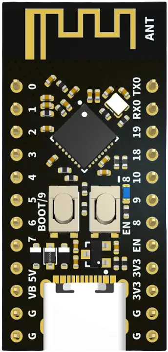
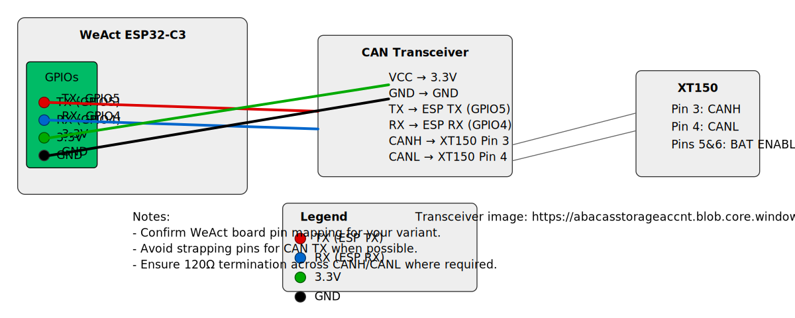

Wiring and Pinout Notes

This file summarizes the wiring required to connect an ESP32 + CAN transceiver to the PowerStream XT150 battery port and a couple of recommended boards.

PowerStream XT150 (face view)

```
PowerStream XT150 Connector (looking at face):
┌─────────────┐
│ 1       2   │  1,2: Wakeup (optional)
│             │
│ 3       4   │  3: CAN High, 4: CAN Low  
│             │
│ 5       6   │  5,6: Battery Enable (SHORT THESE!)
└─────────────┘
```

IMPORTANT: Pins 5 & 6 must be shorted together to enable the battery port. Verify before connecting to avoid damage.

ESP32 → SN65HVD230 (recommended simple transceiver)

- ESP32 GPIO5 (TX)  -> SN65HVD230 TX
- ESP32 GPIO4 (RX)  <- SN65HVD230 RX
- ESP32 3.3V        -> SN65HVD230 VCC
- ESP32 GND         -> SN65HVD230 GND
- SN65HVD230 CANH   -> XT150 Pin 3
- SN65HVD230 CANL   -> XT150 Pin 4

Notes:
- Use a 120Ω termination resistor across CANH/CANL at one or both ends of the bus as required.
- Ensure transceiver is powered at 3.3V and not 5V unless the transceiver and ESP32 are 5V tolerant.

Board-specific notes

- This project targets the ESP32 platform. Use the `esp32:` block in your YAML and set the board variant appropriate for your hardware.
- Board-specific examples are in the `examples/` folder (WeAct ESP32-C3, LilyGO T-CAN485). See `examples/ecoflow-weact.yaml` and `examples/ecoflow-tcan.yaml`.

WeAct board reference image



_Image source: Zephyr Project docs_ — https://docs.zephyrproject.org/latest/_images/weact_esp32c3_mini.webp

CAN transceiver (reference image)

- The transceiver used for the wiring diagram looks like a standard 3.3V CAN transceiver with pins: `VCC`, `GND`, `TX`, `RX`, `CANH`, `CANL`.
- Typical wiring to the ESP32 board/transceiver:
  - `VCC` -> 3.3V
  - `GND` -> GND
  - `TX`  -> selected ESP32 GPIO (example: GPIO5)
  - `RX`  -> selected ESP32 GPIO (example: GPIO4)
  - `CANH` -> XT150 Pin 3
  - `CANL` -> XT150 Pin 4

For visual reference, here's the transceiver image used: https://abacasstorageaccnt.blob.core.windows.net/cirkit/13f01732-48be-4b24-91df-d9bbee1d8aa2.png

Visual wiring diagram (annotated):



If you prefer the vector original, see `docs/weact-wiring.svg`.


Safety & Troubleshooting

- Double-check pin mapping before powering the system.
- Verify CAN bit-rate (PowerStream expects 1Mbps). Note: many ESP32 boards and the default ESPHome CAN implementation do not support 1Mbps; if your hardware does not support it, use `bit_rate: 500kbps` for testing and validation. See examples for board-specific guidance.
- If PowerStream reports "Abnormal Voltage", ensure pins 5 & 6 are shorted and voltage range is within expected limits (40–58V).
- Use an isolated CAN analyzer or oscilloscope to debug CAN timing and voltage levels if you have a bus error.
